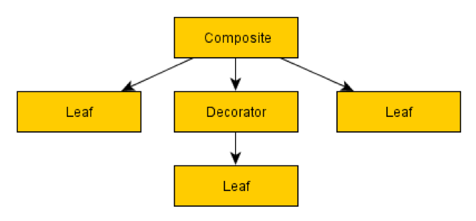
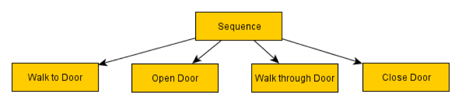
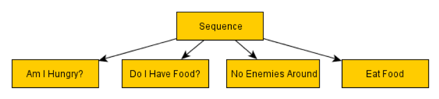
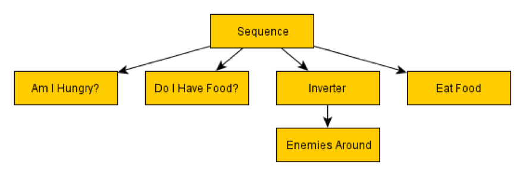
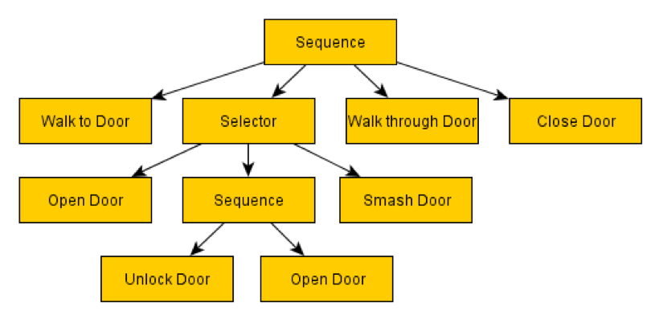
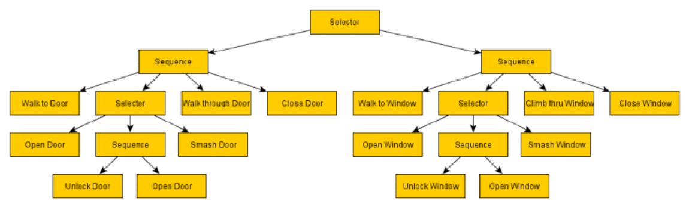

Behavior tree
-------------

**Basics**

Behavior tree is a tree of hierarchical nodes that control the flow of
decision.

**Tree Traversal**

A core aspect of Behavior Trees is that a particular node or branch in
the tree may take many ticks of the game to complete. In the basic
implementation of Behavior trees, the system will traverse down from
the root of the tree every single frame, testing each node down the tree
to see which is active, rechecking any nodes along the way, until it
reaches the currently active node to tick it again.

**Flow**

A Behavior tree is made up of several types of nodes, however some core
functionality is common to any type of node in a Behavior tree. This is
that they can return one of three statuses. There are three common
statuses are as follows:

Success | Failure | Running 

The first two, as their names suggest, inform their parent that their
operation was a success or a failure. The third means that success or
failure is not yet determined, and the node is still running. The node
will be ticked again next time the tree is ticked, at which point it
will again have the opportunity to succeed, fail or continue running.

With this shared functionality in common, there are three main types of
Behavior tree node:

Composite | Decorator | Leaf

Composite

A composite node is a node that can have one or more children. They will
process one or more of these children in either a first to last sequence
or random order depending on the particular composite node in question,
and at some stage will consider their processing complete and pass
either success or failure to their parent, often determined by the
success or failure of the child nodes. During the time they are
processing children, they will continue to return Running to the parent.

The most commonly used composite node is the Sequence, which simply runs
each child in sequence, returning failure at the point any of the
children fail, and returning success if every child returned a
successful status.

Decorator

A decorator node, like a composite node, can have a child node. Unlike a
composite node, they can specifically only have a single child. Their
function is either to transform the result they receive from their child
node's status, to terminate the child, or repeat processing of the
child, depending on the type of decorator node.

A commonly used example of a decorator is the Inverter, which will
simply invert the result of the child. A child fails and it will return
success to its parent, or a child succeeds, and it will return failure
to the parent.

Leaf

These are the lowest level node type and are incapable of having any
children.

Leaves are however the provides some tests or actions required to make
your tree actually do useful stuff.

Since you can define what leaf nodes are yourself (often with very
minimal code), they can be very expressive when layered on top of
composite and decorators, and allow for you to make pretty powerful
behavior trees capable of quite complicated layered and intelligently
prioritized Behavior.

Another integral type of Leaf node is one that calls another Behavior
tree, passing the existing tree's data context through to the called
tree.

These are key as they allow you to modularize the trees
heavily to create Behavior trees that can be reused in countless
places, perhaps using a specific variable name within the context to
operate on. For example, a 'Break into Building' Behavior may expect a
'targetBuilding' variable with which to operate on, so parent trees can
set this variable in the context, then call the sub-tree via a sub-tree
Leaf node.

**Composite Nodes**

Here we will talk about the most common composite nodes found within
Behavior trees. There are others, but we will cover the basics that
should see you on your way to writing some pretty complex Behavior
trees in their own right.

Sequences

The simplest composite node found within Behavior trees; their name
says it all. A sequence will visit each child in order, starting with
the first, and when that succeeds will call the second, and so on down
the list of children. If any child fails it will immediately return
failure to the parent. If the last child in the sequence succeeds, then
the sequence will return success to its parent.

It's important to make clear that the node types in Behavior trees have
quite a wide range of applications. The most obvious usage of sequences
is to define a sequence of tasks that must be completed in entirety, and
where failure of one means further processing of that sequence of tasks
becomes redundant. For example:

This sequence, as is probably clear, will make the given character walk
through a door, closing it behind them. In truth, these nodes would
likely be more abstracted and use parameters in a production
environment. Walk (location), Open (openable), Walk (location), Close
(openable)

The processing order is thus:

Sequence -\> Walk to Door (success) -\> Sequence (running) -\> Open Door
(success) -\> Sequence (running) -\> Walk through Door (success) -\>
Sequence (running) -\> Close Door (success) -\> Sequence (success) -\>
at which point the sequence returns success to its own parent.

The fact that sequences naturally lend themselves to sequences of
character actions, and since Behavior trees tend to suggest this is
their only use, it may not be clear that there are several different
ways to leverage sequences beyond making a character do a sequential
list of 'things'. Consider this:

In the above example, we have not a list of actions but a list of tests.
The child nodes check if the character is hungry, if they have food on
their person, if they are in a safe location, and only if all of these
return successes to the sequence parent, will the character then eat
food. Using sequences like this allow you to test one or more conditions
before carrying out an action. Analogous to if statements in code, and
to an AND gate in circuitry. Since all children need to succeed, and
those children could be any combination of composite, decorator or leaf
nodes, it allows for pretty powerful conditional checking within your AI
brain.

Consider for example the Inverter decorator mentioned in the above
section:

Functionally identical to the previous example, here we show how you can
use inverters to negate any test and therefore give you a NOT gate. This
means you can drastically cut the number of nodes you will need for
testing the conditions of your character or game world.

Selector

Selectors are the yin to the sequence's yang. Where a sequence is an
AND, requiring all children to succeed to return a success, a selector
will return a success if any of its children succeed and not process any
further children. It will process the first child, and if it fails will
process the second, and if that fails will process the third, until a
success is reached, at which point it will instantly return success. It
will fail if all children fail. This means a selector is analogous with
an OR gate, and as a conditional statement can be used to check multiple
conditions to see if any one of them is true.

Their main power comes from their ability to represent multiple
different courses of action, in order of priority from most favorable to
least favorable, and to return success if it managed to succeed at any
course of action. The implications of this are huge, and you can very
quickly develop pretty sophisticated AI Behaviors through the use of
selectors.

Let's revisit our door sequence example from earlier, adding a potential
complication to it and a selector to solve it.

Yes, here we can deal with locked doors intelligently, with the use of
only a handful of new nodes. So, what happens when this selector is
processed?

First, it will process the 'Open Door' node. The most preferable cause
of action is to simply open the door. No messing. If that succeeds then
the selector succeeds, knowing it was a job well done. There's no
further need to explore any other child nodes of that selector.

If, however, the door fails to open because some sod has locked it, then
the 'Open Door' node will fail, passing failure to the parent selector.
At this point the selector will try the second node, or the second
preferable cause of action, which is to attempt to unlock the door.

Here we've created another sequence (that must be completed in entirety
to pass success back to the selector) where we first unlock the door,
then attempt to open it.

If either step of unlocking the door fails (perhaps the AI doesn't have
the key, or the required lockpicking skill, or perhaps they managed to
pick the lock, but found the door was nailed shut when attempting to
open it?) then it will return failure to the selector, which will then
try the third course of action, smashing the door off its hinges!

If the character is not strong enough, then perhaps this fails. In this
case there are no more courses of action left, and the selector will
fail, and this will in turn cause the selector's parent sequence to
fail, abandoning the attempt to walk through the door.

To take this a step further, perhaps there is a selector above that
which will then choose another course of action based on this sequence's
failure?

 

Here we've expanded the tree with a topmost selector. On the left (most
preferable side) we enter through the door, and if that fails, we
instead try to enter through the window.

In short, we have here an 'Enter Building' Behavior that you can rely
on to either get inside the building in question, or to inform its
parent that it failed to. Perhaps there are no windows? In this case the
topmost selector will fail, and perhaps a parent selector will tell the
AI to head to another building?

Random Selectors / Sequences

Random sequences/selectors work identically to their namesakes, except
the actual order the child nodes are processed is determined randomly.

**Decorator Nodes**

Inverter

We've already covered this one. Simply put they will invert or negate
the result of their child node. Success becomes failure, and failure
becomes success. They are most often used in conditional tests.

Succeeder

A succeeder will always return success, irrespective of what the child
node actually returned. These are useful in cases where you want to
process a branch of a tree where a failure is expected or anticipated,
but you don't want to abandon processing of a sequence that branch sits
on. The opposite of this type of node is not required, as an inverter
will turn a succeeder into a 'failer' if a failure is required for the
parent.

Repeater

A repeater will reprocess its child node each time its child returns a
result. These are often used at the very base of the tree, to make the
tree to run continuously. Repeaters may optionally run their children a
set number of times before returning to their parent.

Repeat Until Fail

Like a repeater, these decorators will continue to reprocess their
child. That is until the child finally returns a failure, at which point
the repeater will return success to its parent.

Simplified version of
<https://outforafight.wordpress.com/2014/07/15/Behavior-behavior-trees-for-ai-dudes-part-1/>
